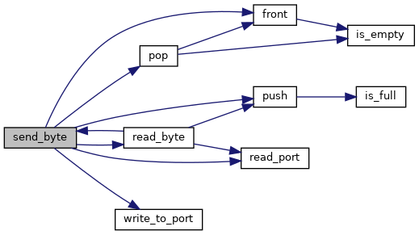

# LCOM: Last Stand
----
## User instructions

### Initial screen

At the start of the game, the user is presented with the following screen:

- The **START** option initiates the game
- The **INSTUCTIONS** option presents the user with the game's intructions
- The **CO-OP** option goes to a 2-player game
- The **EXIT** option quits the program

### Playing Screen

The playing screen displays the player's character, the score, the available magic blasts, the enemies and the current enemy wave.

The user controls the character with the WASD keys ans shoots blast with the mouse's left button click.

The game ends when the character is hit by a projectile.

When the user presses a key, the initial screen is displayed once again.

### Instructions Screen

The instructions screen displays the game's instructions. To exit, the user can press any key.

### CO-OP Screen

The initial CO-OP screen presents the user with a waiting screen, initially.

After the other player is connected, the game is started.

----

## Project Status

### Used I/O devices

| Device| What for | Int |
|---|---|---|
|Timer|Frame Rate|Y|
|KBD|Character Movement and exiting menus|Y|
|Mouse|Menu selection and launching projectiles|Y|
|Graphics card|Screen display|N|
|RTC|Generating enemy waves|Y|
|Serial Port|Co-op mode|Y|

### Graphics card

We decided to use the mode *0x14C*, 1152x864, which corresponds to, approximately, 4294 million colors.
With the graphics card we: use triple buffering and page flipping [swap_buffer()](src/periferals/video_gr.h); detecting collisions [checking_collision()](src/game/enemies.h), [enemy_collision()](src/game/enemies.h) and [wall_collision()](src/game/character_movement.h);

### Keyboard

The keyboard is used primarily for character movement [handle_button_presses()](src/game/character_movement.h). We also use it when exiting a menu screen.

### Mouse

The mouse is used for launching projectiles, we use both the position and the left button click for this. We also use the mouse for selecting an option in the initial screen. [handle_mouse_packet()](src/game/character_movement.h)

### RTC

The RTC is used for launching enemies waves, we use periodical alarms [handle_rtc_ingame_changes()](src/game/game_state.h). We also use the RTC to read the date: [draw_date()](src/game/hud.h) and [draw_time()](src/game/hud.h).

### Serial Port

The serial port is used for the communication between VM's, when playing in the co-op mode. We used interrupts and queues to know when to send/receive data from one VM to another: [queue.h](src/periferals/queue.h) and [serial_port.h](src/periferals/serial_port.h).

----

## Code Organization/ Structure

In this section, the project's modules will be discussed and for each one there will be a call graph of one important function, when applicable.

### character_movement

This module mainly deals with the game's character movement and handles the keyboard/mouse inputs.

**update_character_movement_player()**

**Weigth:** 20%

**Contributors:** Nuno Costa, Gonçalo Alves

### enemies

This module deals with the game's enemy spawning and handles the collisions between the enemies and the player's magic blasts or the player itself.

**checking_collision()**

**Weigth:** 20%

**Contributors:** Nuno Costa, Gonçalo Alves

### game_state

This module deals with the generation of enemy waves, when receiving an RTC interruption.

**get_wave()**

**Weigth:** 20%

**Contributors:** Nuno Costa, Gonçalo Alves

### hud

This module deals with the display of the HUD in the game and the RTC date/time.

**draw_current_hud()**

**Weigth:** 20%

**Contributors:** Nuno Costa, Gonçalo Alves

### magic_blast

This module deals with the generation of magic_blasts.

**throw_magic_blast()**

**Weigth:** 20%

**Contributors:** Nuno Costa, Gonçalo Alves

### menu

This module deals with the select option in the main menu.

**Weigth:** 20%

**Contributors:** Nuno Costa, Gonçalo Alves

### i8042

Constants for programming the i8042 Keyboard Controller (and useful i8254 Timer constants)

**Weigth:** 20%

**Contributors:** Nuno Costa, Gonçalo Alves

### i8254

Constants for programming the i8254 Timer

**Weigth:** 20%

**Contributors:** Nuno Costa, Gonçalo Alves

### interrupt_handler

This module deals with the program setup (subscribing interrupts, creating game objects) and handling the different interruptions. It is also responsible for setting up the termination of the program.

**finish()**

**Weigth:** 20%

**Contributors:** Nuno Costa, Gonçalo Alves

### kbc

This module deals with the Keyboard.

**mouse_read_data()**

**Weigth:** 20%

**Contributors:** Nuno Costa, Gonçalo Alves

### queue

This module implements a queue in C.

**Weigth:** 20%

**Contributors:** Nuno Costa, Gonçalo Alves

### RTC

This module deals with the RTC.

**rtc_read_info()**

**Weigth:** 20%

**Contributors:** Nuno Costa, Gonçalo Alves

### serial_port

This module deals with the UART.

**send_byte()**

**Weigth:** 20%

**Contributors:** Nuno Costa, Gonçalo Alves

### serial_port_controller

Constants for programming the Serial Port

**Weigth:** 20%

**Contributors:** Nuno Costa, Gonçalo Alves

### timer

This module deals with the Timer.

**Weigth:** 20%

**Contributors:** Nuno Costa, Gonçalo Alves

### video_gr

This module deals with the Graphics Card.

**print_animated_sprite()**

**Weigth:** 20%

**Contributors:** Nuno Costa, Gonçalo Alves

----

## Implementation Details

In this project, we tried our hardest to separate the functions that dealt with the peripherals from the functions that dealt with the game logic itself, that is why we have two separate directories. This layering allowed us to write better and modular code.

For event driven code, all of our program works based around user events: key presses, mouse presses, etc.

In regards to state machines, since our project is a game we built around the notion of game states (Menu, Playing, Game Over, etc) and changed behavior of functions depending on this game state, therefore working as a state machine.

For the RTC and Serial Port we opted to use interrupts. In the RTC, we also used the alarms and the date. In the Serial Port, ...

We also had the need to implement a collision detection algorithm, so we did some research to find a way to precisely detect collisions, by pixel overlap, instead of a more simple square collision, by image borders.

----

## Conclusion

LCOM